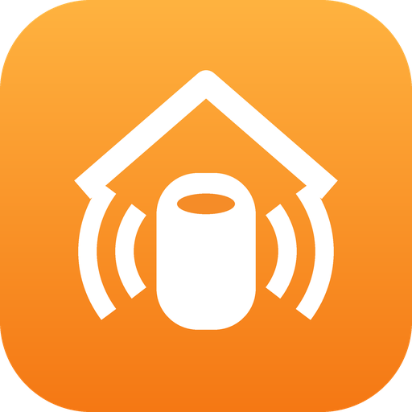

<p align="center">
  
</p>

# HomeKit Intercom for Home Assistant

[](https://github.com/fwhitten/ha-homekit-intercom/actions/workflows/validate.yml)
[](https://hacs.xyz/docs/faq/custom_repositories)
[](https://github.com/fwhitten/ha-homekit-intercom/releases)

Have Home Assistant speak on your **HomePods using Apple's Intercom**.

Home Assistant can't reach HomeKit Intercom directly, so this integration sends a short email that a **Siri Shortcut automation** on your iPhone, iPad or Mac picks up and announces. It takes care of the fiddly parts:

- 🏠 **Zones.** Each zone is a group of HomePods with its own subject prefix, e.g. *All HomePods* → `HA Announce All`.
- 🧺 **Batching.** Messages that arrive close together become one announcement:
  `HA Announce All: The washing machine has finished, the front door is open and dinner is ready.`
- 🚨 **Urgent priority.** Skips the wait and sends immediately.
- 🌙 **Quiet hours.** Holds messages until morning, or discards them.
- ⏱️ **Cooldown and de-duplication.** Stops a flapping sensor repeating itself.
- ✂️ **Length limit.** Very long combined announcements are split across several emails.
- 🧩 **Works everywhere.** Use the `homekit_intercom.announce` action, the standard `notify.send_message` action, or the bundled blueprint.

## Installation

### HACS (recommended)

[](https://my.home-assistant.io/redirect/hacs_repository/?owner=fwhitten&repository=ha-homekit-intercom&category=integration)

1. Click the button above, or in HACS open **⋮ → Custom repositories** and add `https://github.com/fwhitten/ha-homekit-intercom` as an **Integration**.
2. Download **HomeKit Intercom** and restart Home Assistant.
3. Add the integration:

   [](https://my.home-assistant.io/redirect/config_flow_start/?domain=homekit_intercom)

### Manual

Copy `custom_components/homekit_intercom` into your `config/custom_components/` folder and restart.

## Requirements

- Home Assistant 2025.8 or newer. Tested on 2026.9.
- An integration that can send email through a `notify.*` action, such as [Google Mail](https://www.home-assistant.io/integrations/google_mail/) or [SMTP](https://www.home-assistant.io/integrations/smtp/).
- An Apple device that stays signed in to that mailbox and can run Shortcuts automations (iPhone, iPad or Mac). HomePods and Apple TVs can't run email automations.

## Setup

### 1. Configure the integration

- **Notify action:** the action that sends email, e.g. `notify.you_gmail_com` for Google Mail. Choose it from the list.
- **Recipient email:** the mailbox your Shortcut automation watches.
- **First zone:** a name and subject prefix, e.g. `All HomePods` / `HA Announce All`.

To add more zones, go to **Settings → Devices & services → HomeKit Intercom → Add zone**, e.g. `Kitchen HomePods` / `HA Announce Kitchen`. Each zone becomes a device with:

| Entity | Purpose |
| --- | --- |
| `notify.<zone>` | The target for announcements |
| `sensor.<zone>_last_announcement` | Last text sent, with `subject`, `messages` and `last_error` attributes |
| `sensor.<zone>_last_sent` | When the last email was sent |
| `sensor.<zone>_pending_messages` | Messages waiting in the batch |
| `button.<zone>_send_test_announcement` | Sends a test straight away |

### 2. Set up the Siri Shortcut

In the **Shortcuts** app, go to **Automation → New → Email**:

1. **Subject contains** `HA Announce All:`. Set **Run Immediately**, and turn off *Notify When Run*.
2. Actions:
   - **Get Subject** from the *Shortcut Input* email.
   - **Replace** `HA Announce All: ` with nothing.
   - **Intercom** (Home): send the text to *All HomePods*.
3. Repeat for each zone, e.g. `HA Announce Kitchen:` → Intercom to the Kitchen HomePods.

> Tip: use a dedicated mail folder or rule so these emails don't clutter your inbox. The message is in both the subject and the body.

### 3. Announce things

#### The action (for any automation)

```yaml
action: homekit_intercom.announce
target:
  entity_id: notify.all_homepods
data:
  message: "The {{ state_attr(trigger.entity_id, 'friendly_name') }} has finished."
  priority: normal          # or urgent
  key: washing_machine      # optional: de-duplication and cooldown
  cooldown:
    minutes: 15             # optional: requires key
  ignore_quiet_hours: false # optional
```

| Field | Description |
| --- | --- |
| `message` | Required. Templates are rendered when the action runs, not when the email is sent. |
| `priority` | `normal` (batched) or `urgent`. Urgent sends immediately, taking anything already queued with it, and ignores quiet hours. |
| `key` | Names the notification. A newer queued message with the same key replaces the older one. |
| `cooldown` | Ignore the message if the same `key` was accepted within this time. |
| `ignore_quiet_hours` | Send during quiet hours, but still batched. |

`homekit_intercom.flush` sends a zone's queued messages immediately.

#### The notify action

```yaml
action: notify.send_message
target:
  entity_id: notify.kitchen_homepods
data:
  message: The kettle has boiled.
```

#### The blueprint

The integration installs **HomeKit Intercom - announce on state change** in `blueprints/automation/homekit_intercom/`. It announces a message when one or more entities change to a state, with optional extra conditions, cooldown and priority.

Go to **Settings → Automations & scenes → Blueprints** and create an automation from it for each notification you want. Each triggering entity has its own cooldown.

> The integration keeps this file up to date. To customise it, copy it to a different folder first.

## How batching works

```
t=0s   washing machine finished   ─┐
t=3s   front door open             ├─ batch window (5s) resets on each message
t=6s   dinner is ready            ─┘
t=11s  → "HA Announce All: The washing machine has finished, the front door is open and dinner is ready."
```

- **Batch window** (default 5s): how long to wait after the latest message before sending.
- **Maximum wait** (default 30s): send regardless once the first message has waited this long.
- **Joining:** trailing full stops are removed, later messages start lowercase (acronyms like `TV`, words like `HomePod`, and `I` are kept), and one full stop or `!`/`?` goes at the end.
- **Duplicates:** identical messages, or messages sharing a `key`, in the same batch are announced once.
- **Zones:** each zone batches independently and sends its own email.

Change these under **Settings → Devices & services → HomeKit Intercom → Configure**, along with quiet hours and the maximum subject length (default 250 characters).

## Events

Each email sent fires `homekit_intercom_announced`:

```yaml
zone: All HomePods
prefix: HA Announce All
subject: "HA Announce All: The washing machine has finished."
message: "The washing machine has finished."
messages: ["The washing machine has finished."]
```

## Things to know

- **Delay:** iOS runs email automations when Mail receives the message. With push email this is usually a few seconds. With fetch schedules or Low Power Mode it can take minutes. Keep the device charged and on Wi-Fi.
- **Restarts:** queued messages are sent when the integration is reloaded. Anything held for quiet hours is lost on a restart or reload.
- **Email quota:** batching keeps the email count down, but avoid templates that announce on every sensor update.

## Development

```bash
python -m venv .venv && . .venv/bin/activate
pip install -r requirements_test.txt
pytest
```

## License

MIT
